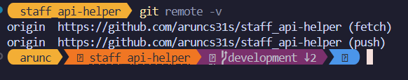
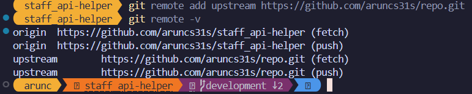

# Git By Doing Level 9 

Find Out the criminals.

## TASK
Your task is to report the criminals to the police. 

After finding out the criminals to report run `python report.py` command in terminal.


### How to play?
1. Clone this repo.
```bash
git clone https://github.com/aruncs31s/git_by_doing_level_9.git
```
2. unzip `robbery.zip` file.
3. Go to the unzipped folder.
4. Open terminal in that folder


## Git remote. 
"basically a bookmark for a different repository from which you may wish to pull or push code" 

if you have clone this repo , run this following command
```bash
git remote
```
You will see something like this
```
origin
```

### What can i do with remote?
Imagine if you have forked one of my repository. And i magine you are working on some new features in that repo, when you fork it becomes your repo , so you have full permission to do anything you want , you can read from the online repo , you can write to the online repo.
you can read using this 
```bash
git pull origin main
```
you can write using this 
```bash
git push origin main
```

And what if i update my repo? like you've clone my repository and when you do `git pull origin main` you are pulling from your repo not mine. 

One way is to go to github.com and press the sync button. But you can setup multiple remotes too 
for example 

```bash
git remote add upstream https://github.com/aruncs31s/repo.git
```
now to pull from my repo you can do this 
```bash
git pull upstream main
```
and to push to your repo you can do this 
```bash
git push origin main
```
But there is a problem , since it is not your repo you can't push to it. Like if you want to have write access to my repository i would have to add you as a collaborator ( ie assign write access to you. )

Also you can see all the remotes using this command 
```bash
git remote -v
```
it will show you something like this 
```




after adding upstream remote you will see something like this 

